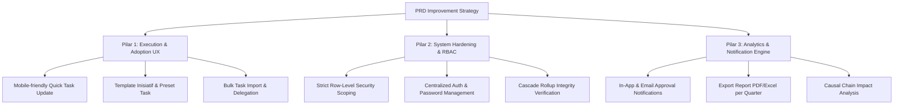

# Dokumentasi & Release Notes Fitur Base Codebase: OKR Dashboard 2 (`okr-dashboard2_dev`)

**Tanggal Audit:** 1 September 2026  
**Sistem / Branding:** Skolla BSC & OKR Suite  
**Tujuan Dokumen:** Memberikan gambaran menyeluruh (_current state_), riwayat rilis/pembaruan fitur, arsitektur data, hingga analisis celah (_technical debt_) sebagai acuan dasar dalam penyusunan **PRD Improvement**.

---

## 1. Ringkasan Eksekutif & Stack Teknologi

Aplikasi **Skolla BSC & OKR Suite** merupakan platform manajemen kinerja berbasis **Balanced Scorecard (BSC)** dan **Objectives & Key Results (OKR)** yang menghubungkan visi strategis perusahaan (Annual BSC) dengan eksekusi harian tim (Initiative & Task).

### Stack Teknologi Utama

| Komponen       | Teknologi & Depedensi Utama                                | Keterangan                                                |
| :------------- | :--------------------------------------------------------- | :-------------------------------------------------------- |
| **Frontend**   | Nuxt 4 (Vue 3), Pinia, Chart.js, Vue Flow, Tailwind CSS    | Single Page App / SSR Hybrid                              |
| **Backend**    | Express 4 (Node.js), TypeScript, Prisma 5 ORM              | RESTful API                                               |
| **Database**   | MySQL (sebelumnya SQLite `dev.db`)                         | Berhasil dimigrasi dengan script `migrate_production.sql` |
| **Otentikasi** | JWT (HS256) via HTTP Header (`Authorization: Bearer`)      | Token 24 Jam, simpan di `localStorage`                    |
| **Deployment** | Docker (`docker-compose.yml`), PM2 (`ecosystem.config.js`) | Containerized backend & frontend                          |

---

## 2. Model Arsitektur Hierarki BSC & OKR (4-Level Structure)

Kodebase terkini mengimplementasikan hierarki data 4-level terintegrasi dengan otomatisasi _weighted-average rollup_:

```
[Level 1: Objective] (Tahunan, per Perspektif BSC)
       │
       ▼
[Level 2: AnnualKeyResult] (BSC Tahunan)
       │
       ▼
[Level 3: KeyResult] (KR Bulanan - e.g. "2026-08")
       │
       ▼
[Level 4: Initiative] (P-Level / Inisiatif Strategis)
       │
       ▼
[Task / Sub-Initiative] (T-Level / Tugas Eksekusi - Dahulu bernama KPI)
```

### Aturan Agregasi Data (_Rollup Logic_):

1. **Task (T-Level) → Initiative (P-Level)**: Progres `Initiative` dihitung secara otomatis dari _weighted average_ `Task` anak-anaknya berdasarkan field `Task.weight`.
2. **Initiative (P-Level) → KeyResult Bulanan (Level 3)**: Progres `KeyResult` bulanan dihitung dari _weighted average_ `Initiative` berdasarkan field `Initiative.weight`.
3. **KeyResult Bulanan (Level 3) → AnnualKeyResult (Level 2)**: Progres `AnnualKeyResult` tahunan dihitung dari agregasi 12 bulan `KeyResult` berdasarkan `KeyResult.monthWeight`.
4. **Manual Override Guard**: KR Bulanan yang memiliki `Initiative` aktif **dikunci dari input manual** (`isManualOverride = false`). Input manual hanya diizinkan untuk KR legacy yang belum memiliki `Initiative`.

---

## 3. Catatan Rilis Feature (Release Notes History)

Berikut adalah rekapitulasi riwayat rilis dan pembaruan fitur berdasarkan git history codebase:

### 📦 Release 1.0: MVP Foundation (Juli 2026)

- **OKR & BSC Core**: Pengelolaan Objective, Key Result, serta visualisasi 4 Perspektif BSC (Financial, Customer, Internal Process, Learning & Growth).
- **RACI Matrix**: Penugasan RACI (_Responsible, Accountable, Consulted, Informed_) pada setiap Key Result.
- **Strategy / Causal Map**: Diagram interaktif keterkaitan antar KR menggunakan library `Vue Flow`.
- **Responsive Dashboard**: Layout adaptif untuk memantau capaian OKR perusahaan.

### 📦 Release 1.1: Management & C-Level Control (Awal - Pertengahan Agustus 2026)

- **C-Level Executive Dashboard**: Dashboard khusus executive untuk memantau _health score_ perusahaan.
- **Initiative Kanban Board**: Papan Kanban inisiatif dengan status `TODO`, `IN_PROGRESS`, `DONE`, dan `DROP`.
- **Bulk Import CSV**: Modul pengunggahan CSV massal untuk Objective, KR, RACI, dan Inisiatif.
- **Docker Support**: Pengemasan aplikasi menggunakan Dockerfile & Docker Compose.

### 📦 Release 1.2: Database Migration & Hierarki BSC 4-Level (Pertengahan - Akhir Agustus 2026)

- **MySQL Migration**: Transisi dari SQLite ke MySQL untuk skalabilitas database produksi.
- **Annual BSC & Monthly KR Split**: Penambahan entitas `AnnualKeyResult` dan pemisahan KR Bulanan (`month`, `monthWeight`).
- **Refactoring KPI menjadi Task**: Redefinisi istilah KPI menjadi `Task` (T-Level) dengan dukungan bobot (`weight`) dan _documentation link_.
- **Otomatisasi Rollup Multi-Tier**: Perhitungan otomatis bertingkat dari Task → Initiative → Monthly KR → Annual BSC.

### 📦 Release 1.4: Master KPI, Approvals History, & Simplified Progress Rollup (3 September 2026)

- **Modul Master KPI & Multi-KPI Selector**: Pembentukan tabel `Kpi`, `InitiativeKpi`, `TaskKpi`, komponen `KpiSelector.vue` pada modal pembuatan/edit inisiatif dan task, serta halaman pengelolaan Master KPI Admin (`admin/kpis.vue`) lengkap dengan fitur **Bulk Upload Excel**.
- **Fitur Reset Password User & SkollaEdu Integration**: Layanan reset password pengguna dari sisi Admin dengan CTA terintegrasi kembali ke SkollaEdu.
- **Riwayat Persetujuan & Pembersihan Sidebar**: Tab switcher **Antrean Persetujuan** vs **Riwayat Persetujuan** pada `approvals.vue` lengkap dengan metadata peninjau & timestamp `reviewedAt`, serta pembersihan badge notifikasi sidebar agar terpusat pada header bar.
- **Label PIC Inisiatif**: Penampilan badge `PIC: Nama Leader/Owner` di baris inisiatif pada halaman _KR Saya_ (`my-krs.vue`).
- **Dukungan Stage "Drop" di Pelaporan Progress**: Opsi stage "Drop" pada modal pelaporan progress inisiatif (`my-work.vue`) yang tersinkronisasi otomatis dengan Papan Kanban Inisiatif.
- **Penyederhanaan Perhitungan Rollup (Tanpa Bobot)**: Peniadaaan input & badge bobot (_weight_) pada UI Inisiatif/Task, serta pembaruan perhitungan backend:
  - Satuan `%`: Rata-rata sederhana (_simple average_).
  - Satuan Nominal (`IDR`, `Qty`, `Jam`, `Unit`, dll): Penjumlahan nilai riil (_real sum_).

### 📦 Release 1.5: Kanban Card Monitoring, Direct Stage Update, & Collapsible My-Work (4 September 2026)

- **Restrukturisasi Papan Inisiatif (Kanban Murni Monitoring)**:
  - Tombol header diubah dari `+ Tambah Inisiatif` menjadi `+ Tambah Card` dengan dukungan terpadu pembuatan kartu **Inisiatif** maupun **Task Turunan** (dengan pilihan inisiatif induk).
  - Papan Kanban dijadikan murni untuk monitoring: menonaktifkan geser kartu (drag-and-drop), serta menghapus tombol edit, tombol pindah stage (Maju/Mundur), dan shortcut `+ Task` dari kartu individual.
- **Peningkatan Fitur Menu Pekerjaan Saya (`my-work.vue`)**:
  - **Direct Stage Selector Dropdown**: Penambahan dropdown selector stage (`TO DO`, `IN PROGRESS`, `DONE`, `DROP`) langsung pada setiap kartu Inisiatif & Task di Pekerjaan Saya untuk perpindahan status alur kerja secara langsung.
  - **Dukungan Pembuatan Task oleh T-Level & P-Level**: Tombol `+ Buat Task Baru` di bawah kartu inisiatif pada Pekerjaan Saya, memungkinkan T-Level (Team Member) membuat Task baru dengan default assignee terisi otomatis ke diri sendiri (dan opsi memilih rekan 1 tim).
- **Desain UI Ringkas & Collapsible Section**:
  - Penambahan kapabilitas **Expand / Collapse** pada section _Inisiatif Saya_ dan _Inisiatif Tim_ di Pekerjaan Saya dengan indikator panah toggle (▼ / ▶) dan counter badge. Default berstatus **Tertutup (Collapsed)** saat halaman dimuat untuk kerapian dan kenyamanan navigasi.

---

## 4. Matriks Kemampuan Otorisasi (RBAC Current State)

Berdasarkan middleware `roleGuard` dan kontrol logika backend saat ini:

| Modul & Akses Fitur                  |   ADMIN    |  C_LEVEL   |   MANAGER   |    LEADER    |    TEAM     |
| :----------------------------------- | :--------: | :--------: | :---------: | :----------: | :---------: |
| **Lihat Dashboard Executive & BSC**  | Perusahaan | Perusahaan | Departemen  | Tim Dipimpin | Tim Sendiri |
| **CRUD Objective & Annual BSC**      |     ✅     | Read Only  |  Read Only  |  Read Only   |  Read Only  |
| **CRUD Key Result & Assign RACI**    |     ✅     | Read Only  | Assign RACI |  Read Only   |  Read Only  |
| **CRUD Initiative (P-Level)**        |     ✅     |     —      |     ✅      |      ✅      | Tim Sendiri |
| **CRUD Task (T-Level)**              |     ✅     |     —      |     ✅      |      ✅      |      —      |
| **Submit Progres Task / Initiative** |     ✅     |     —      |     ✅      |      ✅      |     ✅      |
| **Approve / Reject Progress Update** |     ✅     |     —      |     ✅      |      ✅      |      —      |
| **Lihat Member Achievement**         |     ✅     |     ✅     | Departemen  |     Tim      | Profil Self |
| **Manage Employee & Department**     |     ✅     |     —      |      —      |      —       |      —      |
| **Bulk Import Data CSV**             |     ✅     |     —      |      —      |      —       |      —      |

---

## 5. Status Fitur & Inventaris Halaman Frontend

Terdapat **22 Halaman Vue** di dalam `frontend/app/pages/`:

| Halaman Frontend (`.vue`)      | Fungsi Utama                                                   | Status                 |
| :----------------------------- | :------------------------------------------------------------- | :--------------------- |
| `index.vue` / `dashboard.vue`  | Dashboard utama OKR, grafik tren bulanan, & matriks departemen | Active (Bisa diakses)  |
| `c-level.vue`                  | Executive Dashboard khusus C-Level                             | Active                 |
| `bsc-view.vue`                 | Matriks tampilan 4 Perspektif BSC                              | Active                 |
| `strategy-map.vue`             | Causal Relationship Map (Vue Flow)                             | Active                 |
| `approvals.vue`                | Halaman approval persetujuan update progress Task/Initiative   | Active                 |
| `member-achievement.vue`       | Pemantauan progres & skor individu pegawai                     | Active                 |
| `initiatives.vue`              | Kanban Board Inisiatif & Task Management                       | Active                 |
| `admin/annual-bsc.vue`         | Kelola BSC Tahunan (`AnnualKeyResult`) & link KR bulanan       | Active (Admin)         |
| `admin/objectives.vue`         | CRUD Objective & Key Result Bulanan                            | Active (Admin)         |
| `admin/employees.vue`          | Manajemen pegawai & penugasan role                             | Active (Admin)         |
| `admin/departments.vue`        | Manajemen Struktur Departemen                                  | Active (Admin)         |
| `admin/update-progress.vue`    | Fast update progress KR                                        | Active (Admin)         |
| `admin/initiatives-kanban.vue` | Kanban Board (Duplikat dari `initiatives.vue`)                 | Unreachable / Orphaned |
| `leader/initiatives.vue`       | Inisiatif versi Leader (Duplikat)                              | Unreachable / Orphaned |
| `leader/my-krs.vue`            | Tampilan KR untuk Leader                                       | Active                 |
| `team/my-work.vue`             | Workspace tugas individu (Role TEAM)                           | Active                 |
| `manager/overview.vue`         | Overview departemen untuk Manager                              | Active                 |
| `kr-history.vue`               | Log riwayat perubahan nilai KR                                 | Active                 |
| `departments.vue`              | Daftar departemen (Duplikat admin)                             | Unreachable / Orphaned |
| `login.vue`                    | Form Autentikasi Login                                         | Active                 |

---

## 6. Temuan Kunci & Technical Debt (Bahan Pertimbangan PRD)

Sebelum merancang PRD Improvement, berikut adalah kondisi teknis dan celah (_gaps_) yang ditemukan pada codebase:

### A. Adopsi Data (_Data Adoption Gap_)

- **Temuan**: Data lapisan atas (Objective, Key Result, RACI) sudah terisi pesat di database. Namun, data pada lapisan eksekusi (Task, TaskUpdate, InitiativeUpdate, CausalLink) masih sangat minim.
- **Implikasi PRD**: PRD berikutnya harus memprioritaskan **kemudahan UX eksekusi** (seperti quick-submit via WhatsApp/slack bot, form update sederhana, onboarding/template inisiatif) agar tim bawah aktif mengisi data.

### B. Keamanan & RBAC Filtering

1. **Endpoint Leakage**: `GET /api/objectives` mengembalikan seluruh pohon data OKR perusahaan ke semua role tanpa scoping departemen.
2. **Cross-Department Approval**: Pada `initiative.controller.ts`, validasi role `MANAGER` di endpoint `approveTaskUpdate` belum membatasi departemen secara ketat, sehingga Manager berpotensi menyetujui update departemen lain.
3. **Causal Link Mutation**: `PUT` & `DELETE` pada `/api/causal-links/:id` belum dilengkapi `roleGuard`, sehingga role non-admin dapat mengubah peta strategis.

### C. Arsitektur Codebase & Maintenance

1. **Halaman Duplikat (Redundant Code)**: Terdapat ±3.200 baris kode Vue mati pada halaman duplikat (`admin/initiatives-kanban.vue`, `leader/initiatives.vue`, `admin/departments.vue`) yang perlu dibersihkan.
2. **Global API Composable**: Setiap halaman Vue melakukan `fetch()` manual dengan header authorization terpisah, belum ada composable `useApi()` terpusat dengan _interceptor_ logout otomatis saat token expired.
3. **Automated Testing & CI**: Belum ada jaring pengaman unit test / E2E test dan pipeline CI/CD.

---

## 7. Rekomendasi Area Fokus PRD Improvement

Untuk penyusunan PRD Improvement mendatang, direkomendasikan membagi ke dalam 3 Pilar Utama:



### Detail Prioritas Fitur:

1. **Pilar 1 (Adoption & Execution UX)**:
   - **Quick Update Widget**: Memudahkan role `TEAM` melakukan submit progres task harian/mingguan beserta lampiran link bukti pekerjaan.
   - **Inisiatif Template & Sub-Task Presets**: Template standar inisiatif berdasarkan departemen.
2. **Pilar 2 (System Hardening & RBAC)**:
   - **Strict Query Scoping**: Memastikan semua endpoint `GET` memfilter data sesuai hirarki organisasi user.
   - **Password Management**: Endpoint ubah password, reset password, dan paksa ubah password saat login pertama kali.
3. **Pilar 3 (Notification & Reporting)**:
   - **Approval Notification Engine**: Notifikasi ke Manager/Leader ketika ada pengajuan progress update baru.
   - **Report Export Engine**: Fitur ekspor laporan kinerja per departemen / kuartal ke format PDF dan Excel.

---

_Dokumen ini dibuat secara otomatis dari analisis langsung terhadap codebase `okr-dashboard2_dev` per 1 September 2026._
