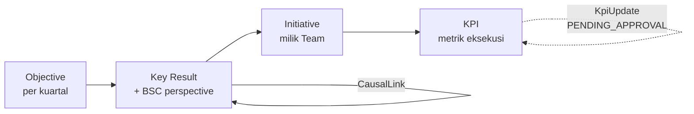
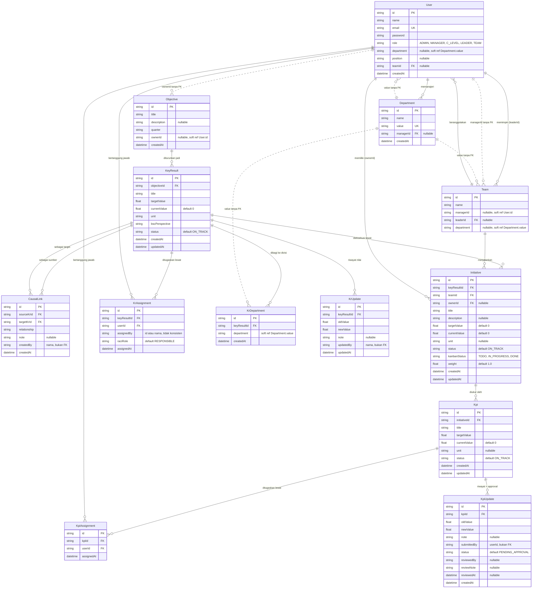

# ERD — OKR Dashboard

Sumber kebenaran: [backend/src/prisma/schema.prisma](../backend/src/prisma/schema.prisma) (SQLite via Prisma).
13 model, 4 lapisan: Identitas & Organisasi → Inti OKR → Eksekusi → Penugasan & Riwayat.

## Alur cascade

Progres mengalir ke atas: nilai KPI → `Initiative.currentValue` (berbobot `weight`) → `KeyResult.currentValue` → status Objective.

## Diagram relasi lengkap

Garis putus-putus = relasi logis yang **tidak** punya foreign key di database.

## Junction table

| Tabel | Menghubungkan | Unique constraint | Kolom tambahan |
|---|---|---|---|
| `KrAssignment` | KeyResult ↔ User | `[keyResultId, userId]` | `raciRole`, `assignedBy` |
| `KpiAssignment` | Kpi ↔ User | `[kpiId, userId]` | — |
| `KrDepartment` | KeyResult ↔ Department (by string) | `[keyResultId, department]` | — |

## Catatan integritas data

1. **`Objective.ownerId` tanpa relasi Prisma.** Field-nya ada tapi tidak dideklarasikan sebagai relasi, jadi objective bisa menunjuk user yang sudah dihapus. Sama untuk `Team.managerId`.
2. **Divisi disimpan sebagai string di 3 tempat** (`User.department`, `Team.department`, `KrDepartment.department`) yang menunjuk `Department.value` tanpa FK. Rename satu divisi berarti update manual di semua tabel itu.
3. **`KrAssignment.assignedBy` tidak konsisten:** [keyresult.controller.ts:326](../backend/src/controllers/keyresult.controller.ts#L326) mengisi `req.user?.id`, sementara [bulkUpload.controller.ts:204](../backend/src/controllers/bulkUpload.controller.ts#L204) mengisi nama user. Kolom yang sama menyimpan dua jenis nilai.
4. **Kolom audit lain menyimpan nama, bukan id:** `KrUpdate.updatedBy`, `CausalLink.createdBy` menggunakan `name || email`. `KpiUpdate.submittedBy` menggunakan id.
5. **Tidak ada cascade delete di schema.** Penghapusan KR menghapus anak-anaknya lewat kode controller, bukan constraint database.
